🔍 Summary: Collaboration, Efficiency, and Equity in CCI Projects

Our analysis of California Climate Investments (CCI) projects using both Propensity Score Matching (PSM) and regression models reveals that collaboration plays a critical but nuanced role in shaping project outcomes. High-collaboration projects—especially those spanning multiple counties—are significantly more cost-effective, reducing GHGs at nearly one-seventh the cost per ton compared to less collaborative efforts. These projects are also more equitable, directing a higher share of funding to Disadvantaged Communities (DACs).

However, regression models show that the form of collaboration matters. While a broader geographic scope (multi-county projects) correlates with higher DAC funding shares, simply increasing the number of county partners is associated with a modest decline in equity outcomes, potentially due to challenges in maintaining targeted DAC investments across a larger set of jurisdictions. Importantly, this negative effect is less pronounced in Southern California, suggesting regional variation in collaboration dynamics. Together, these findings underscore the importance of fostering intentional, regionally tailored collaboration strategies that balance cost efficiency with equity objectives.

```mermaid
graph TD
    A[Collaboration Level]
    A --> B[Multi-County Collaboration]
    A --> C[Many County Partners]

    B --> D1[↑ GHG Cost-Effectiveness]
    B --> D2[↑ DAC Funding Share]

    C --> E1[↑ GHG Cost-Effectiveness]
    C --> E2[↓ DAC Funding Share]

    D1 --> F[PSM Results:\nBoth Outcomes Increase]
    D2 --> F

    E1 --> G[Regression Results:\nNuanced Trade-offs]
    E2 --> G

    G --> H[Regional Variation:\nSoCal Mitigates Equity Decline]


```

